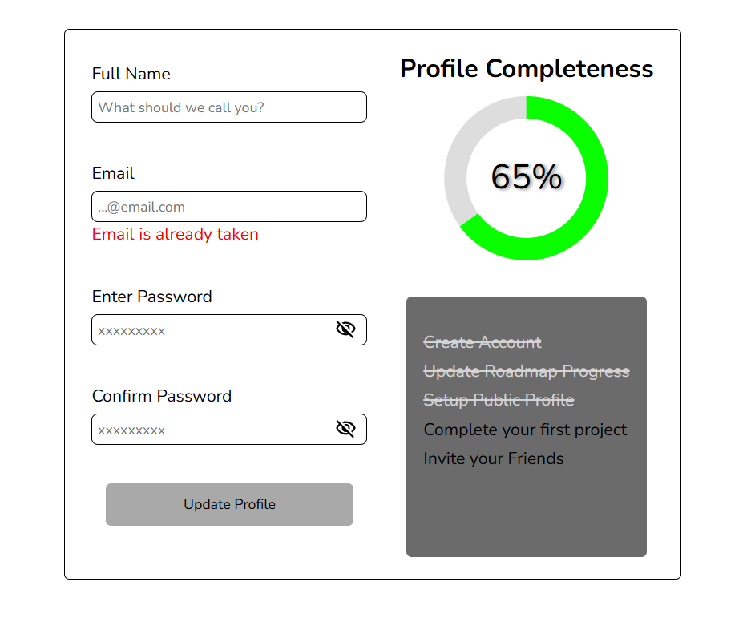

  <h1 align="center">
    Accessible Form UI
  </h1>

 

# Objective
Create a form UI using only HTML and CSS including fields for a full name, email, password, and confirm password, along with a button to toggle the visibility of the password text. The form will feature a completeness progress bar and a checklist of requirements that must be met for the form to reach 100% completeness.
  

# README
https://roadmap.sh/projects/accessible-form-ui
 
 

# PREVIEW

# EXTRA FEATURES
Circle progress bar already prepared to be dynamic using an script. 
 
 

# Auxiliary Resources
<ul>
  <li>
    <a href="https://www.30secondsofcode.org/css/s/circular-progress-bar/" alt=How can I create a circular progress bar using only CSS?"How can I create a circular progress bar using only CSS?/</a>
     
    An article explaing in details how to make a circle progress bar using only CSS. Used as the main concept for the progress bar in this project.
  </li>
</ul>
 
<h3>Links used to get an understanding of specific attributes used in the progress bar:</h3>
<ol>
  <li>
    <a href="https://www.w3schools.com/graphics/svg_intro.asp" alt="SVG Tutorial">SVG Tutorial</a>
  </li>
  <li>
    <a href="https://www.w3schools.com/graphics/svg_circle.asp" alt="SVG < circle > tag">SVG < circle > tag</a>
  </li>
  <li>
    <a href="https://www.w3schools.com/graphics/svg_stroking.asp" alt="SVG Stroke Attributes">SVG Stroke Attributes<a/>
  </li>
  <li>
    <a href="https://www.w3schools.com/cssref/css3_pr_transform.php" alt="CSS transform Property">CSS transform Property<a/>
  </li>
  <li>
    <a href="https://www.w3schools.com/cssref/css3_pr_transform-origin.php" alt="CSS transform-origin Property">CSS transform-origin Property<a/>
  </li>
</ol>
